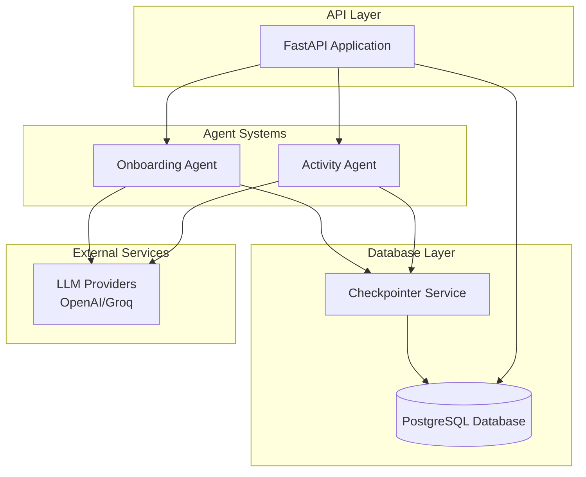
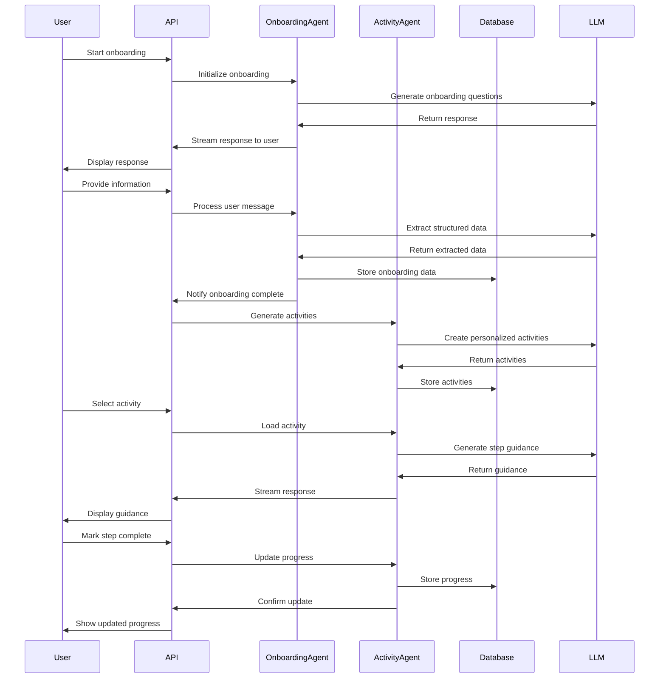
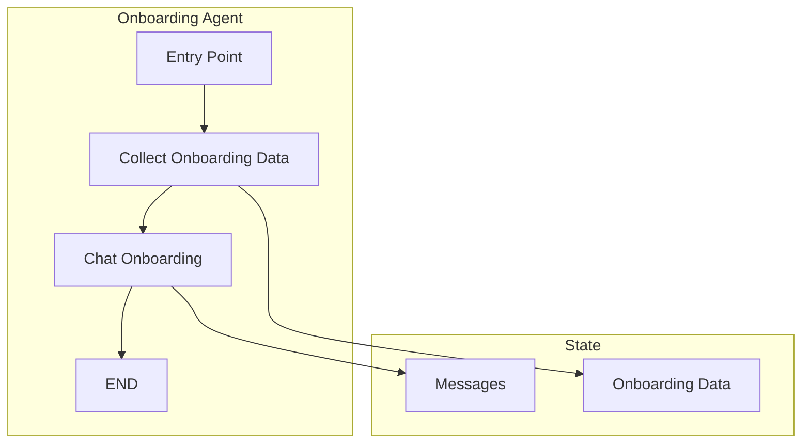
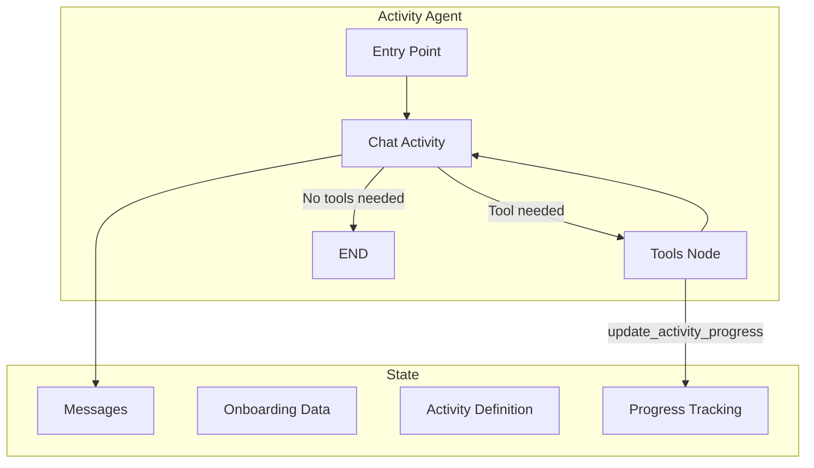

# InversoAI: Personalized Financial Education Platform

## 1. Introduction

### What problem are we solving?

Financial literacy is a critical life skill, yet many people struggle to find personalized, engaging, and actionable financial education. Traditional financial education often fails to connect with individuals' specific life circumstances, goals, and knowledge levels, making it difficult for people to apply financial concepts to their own lives.

### What is our main goal?

InversoAI aims to democratize financial education by creating a highly personalized learning experience that adapts to each user's unique background, goals, and knowledge level. We make financial concepts accessible through interactive conversations and tailored activities that connect directly to users' real-life situations.

### What value does our project provide?

- **Personalization**: Learning experiences tailored to individual users based on their life stage, profession, goals, and knowledge level
- **Accessibility**: Complex financial concepts explained in simple, relatable terms specific to each user's context
- **Actionability**: Step-by-step activities that build practical financial skills rather than just theoretical knowledge
- **Engagement**: Interactive conversations with AI financial coaches that make learning enjoyable and memorable
- **Progression**: Educational journey that evolves with users as they build their knowledge and achieve their financial goals

## 2. Detailed Project Description

### What exactly does our project do?

InversoAI is a Spanish-language financial education platform that uses AI assistants to deliver personalized learning experiences. The platform follows these key steps:

1. **Personalized onboarding**: Collects user information through a conversational interface, gathering details about life stage, profession, age, financial goals, interests, concerns, and knowledge level.

2. **Activity generation**: Creates tailored financial learning activities based on the user's profile, ensuring that content is relevant to their specific situation.

3. **Interactive guidance**: Provides step-by-step coaching through financial activities, using conversation to explain concepts, answer questions, and adapt to the user's pace and understanding.

4. **Progress tracking**: Monitors user progress through activities, marking steps as "Not started," "In progress," or "Completed" to maintain momentum.

5. **Knowledge building**: Builds financial literacy progressively, with activities that range from beginner to advanced levels, ensuring continuous learning and development.

### How does it work step-by-step?

1. **User onboarding**:

   - User begins conversation with the onboarding agent
   - Agent asks questions about the user's financial background, goals, and knowledge
   - Information is structured and stored in a database
   - When all required information is collected, onboarding is marked as complete

2. **Activity creation**:

   - System generates personalized financial activities based on onboarding data
   - Activities are created with clear steps, objectives, and explanations tailored to the user
   - Activities are stored in the database for the user to access

3. **Activity interaction**:

   - User selects an activity to work on
   - Activity agent guides the user through each step with conversational instructions
   - Agent adapts explanations based on user responses and questions
   - Progress is tracked and updated in real-time

4. **Learning reinforcement**:
   - Key financial concepts are explained in context with real-world examples
   - Glossary provides clear definitions of financial terms
   - Alternative methods offer different approaches for different learning styles
   - Background information connects concepts to the user's personal situation

### What specific use cases does it cover?

1. **Financial beginners** seeking basic knowledge in areas like budgeting, saving, and understanding credit, with explanations adapted to their specific life context.

2. **Working professionals** looking to optimize their finances with personalized guidance on topics like investing, retirement planning, and tax efficiency.

3. **People with specific financial goals** (e.g., saving for a house, building an emergency fund) who need structured, step-by-step guidance to achieve their objectives.

4. **Individuals facing financial transitions** (new job, marriage, retirement) who need tailored advice for their changing circumstances.

5. **Financial education providers** seeking to offer personalized, engaging content that adapts to each learner's needs and background.

## 3. Technologies Used

### Core Technologies and Frameworks

- **FastAPI**: Web framework for building the API endpoints, chosen for its high performance, async support, and strong typing
- **LangChain**: Framework for building applications with LLMs, used for constructing the conversation flows and agent interactions
- **LangGraph**: Tool for creating agent workflows with state management, providing the architecture for our agent systems
- **PostgreSQL**: Database for storing user data, activities, and conversation state
- **SQLModel/SQLAlchemy**: ORM for database interactions, providing type safety and query generation
- **Pydantic**: Data validation library used for robust type checking and schema definition
- **TrustCall**: Structured output extraction tool that ensures reliable data collection from LLM responses
- **OpenAI/Groq**: Large language model providers that power the conversational AI capabilities

### Supporting Libraries

- **langgraph-checkpoint-postgres**: Enables persisting agent state to PostgreSQL for stateful conversations
- **Asyncpg/Psycopg**: PostgreSQL drivers for async database operations
- **Pydantic-AI**: Helper utilities for working with LLMs and structured data extraction
- **UV**: Modern Python package manager and installer for dependency management

## 4. Project Architecture

InversoAI uses a modular architecture built around two primary agent systems that interact with a shared database. The application is designed to be stateful, maintaining conversation context across user sessions.



### Key Components

1. **API Layer**:

   - Handles HTTP requests and responses
   - Manages authentication and user sessions
   - Routes requests to appropriate agents and services
   - Streams responses using Server-Sent Events (SSE)

2. **Agent Systems**:

   - Stateful conversation agents with persistent memory
   - Onboarding Agent collects user information
   - Activity Agent guides users through financial activities

3. **Database Layer**:

   - Stores user profiles and onboarding data
   - Manages activity definitions and progress
   - Persists conversation state via checkpointing

4. **External Services**:
   - LLM providers (OpenAI/Groq) for conversational AI capabilities
   - State persistence via PostgreSQL

### Data Flow



## 5. Agent Architectures

### Onboarding Agent

The Onboarding Agent is responsible for collecting user information through conversational interaction, structuring this data, and determining when onboarding is complete.



**Specific functions and roles**:

1. **Collect Onboarding Data**:

   - Extracts structured information from user messages
   - Builds a comprehensive user profile
   - Uses TrustCall for reliable data extraction from LLM outputs
   - Updates onboarding data state with newly extracted information

2. **Chat Onboarding**:

   - Guides the conversation based on current onboarding progress
   - Identifies missing information and prompts user accordingly
   - Adapts questions based on previous responses
   - Uses a different prompt once all information is collected

3. **State Management**:
   - Maintains a list of messages for conversation context
   - Tracks onboarding data completeness
   - Signals completion when all required fields are collected

### Activity Agent

The Activity Agent manages the interactive learning process, guiding users through financial activities and tracking their progress.



**Specific functions and roles**:

1. **Chat Activity**:

   - Provides interactive guidance for each activity step
   - Adapts explanations based on user's background and knowledge level
   - Asks questions to ensure understanding and engagement
   - Processes user responses to determine next action

2. **Tools**:

   - `update_activity_progress`: Updates the status of activity steps
   - Maintains step status as "Not started," "In progress," or "Completed"
   - Broadcasts progress updates to the frontend

3. **State Management**:
   - Maintains conversation history
   - Tracks user's progress through the activity
   - Stores the activity definition with all its components
   - Contains onboarding data for personalized context

## 6. Installation and Execution Instructions

### Prerequisites

- Python 3.13+
- PostgreSQL database
- API keys for OpenAI and Groq

### Installation Steps

1. **Clone the repository**:

   ```bash
   git clone https://github.com/your-username/inverso-bot-ai.git
   cd inverso-bot-ai
   ```

2. **Install UV package manager**:

   ```bash
   curl -LsSf https://astral.sh/uv/install.sh | sh
   ```

3. **Install project dependencies**:

   ```bash
   uv sync
   ```

4. **Configure environment variables**:

   ```bash
   cp .env.example .env
   ```

   Edit the `.env` file with your API keys and database configuration:

   ```
   OPENAI_API_KEY=your_openai_api_key
   GROQ_API_KEY=your_groq_api_key

   DATABASE_HOST=localhost
   DATABASE_PORT=5432
   DATABASE_USER=postgres
   DATABASE_PASSWORD=your_password
   DATABASE_NAME=inverso_ai
   DATABASE_POOL_SIZE=50
   DATABASE_POOL_MAX_OVERFLOW=50

   INVERSO_API_KEY=your_api_key_for_auth
   ```

5. **Set up the database**:

   You can use your favorite PostgreSQL client to create the database.
   The application will automatically initialize the database schema on startup.

### Running the Project

1. **Development mode**:

   ```bash
   uv run fastapi dev
   ```

2. **Production mode**:

   ```bash
   uv run fastapi run
   ```

3. **Generate public activities** (optional):
   ```bash
   uv run python scripts/generate_public_activities.py
   ```

### API Endpoints

- **Onboarding**:

  - `POST /api/v1/chat/onboarding/`: Start or continue onboarding conversation
  - `GET /api/v1/chat/onboarding/`: Get current onboarding state

- **Activity**:
  - `POST /api/v1/chat/activity/`: Start or continue activity conversation
  - `GET /api/v1/chat/activity/`: Get current activity state
  - `POST /api/v1/activity/onboarding`: Generate activities from onboarding data
  - `POST /api/v1/activity/concepts`: Generate activity from financial concepts
  - `GET /api/v1/activity/public`: Get all public activities
  - `GET /api/v1/activity/user/{user_id}`: Get user-specific activities

## 7. Results and Demonstrations

### Achieved Results

- **Personalized Onboarding**: Successfully developed a conversational onboarding system that collects comprehensive user information and structures it for activity generation.

- **Dynamic Activity Generation**: Created an AI system that generates highly tailored financial education activities based on user data, with appropriate difficulty levels and relevant examples.

- **Interactive Learning Experience**: Built a conversational activity guide that walks users through financial concepts and practical steps, adapting explanations to their background and knowledge level.

- **Progress Tracking**: Implemented a system to track user progress through activities, allowing users to pick up where they left off and see their advancement.

- **Multi-Level Content**: Developed a framework for financial education at beginner, intermediate, and advanced levels, ensuring users can progress at their own pace.

### Testing the Project

1. **Start onboarding**:

   - Make a POST request to `/api/v1/chat/onboarding/` with a new thread ID
   - Engage in conversation to provide your financial background and goals
   - Complete the onboarding process to generate your profile

2. **Generate activities**:

   - After onboarding, make a POST request to `/api/v1/activity/onboarding` with your onboarding data
   - Review the generated activities tailored to your profile

3. **Interact with an activity**:
   - Choose an activity and make a POST request to `/api/v1/chat/activity/` with the activity data
   - Follow the step-by-step guidance from the activity agent
   - Mark steps as completed as you progress

## 8. Conclusions and Next Steps

### What we've learned

- Personalization significantly enhances financial education by making abstract concepts concrete and relevant to individual users.

- State management is critical for maintaining conversational context and delivering a coherent educational experience.

- A modular agent architecture allows for specialized components that excel at specific tasks while sharing a common data foundation.

- LLMs can effectively structure financial education content when provided with clear guidelines and user context.

- Interactive, step-by-step activities are more engaging and effective than passive content consumption.

### Future improvements

1. **Progress Analytics**: Add analytics to track user progress across multiple activities and identify areas for improvement.

2. **Content Expansion**: Generate more specialized activities for different financial situations and goals.

3. **Multimedia Integration**: Incorporate charts, graphs, and interactive calculators to enhance the learning experience.

4. **Community Features**: Add the ability for users to share progress and engage with others on similar financial journeys.

5. **Mobile Application**: Develop a mobile app for easier access to financial education on the go.

6. **Feedback Loop Integration**: Incorporate user feedback to continuously improve activity generation and guidance.

7. **Expert Review System**: Add a layer of expert review for generated content to ensure accuracy and quality.

8. **Real-World Financial Integration**: Connect with financial institutions to allow users to apply what they've learned to their actual finances.
